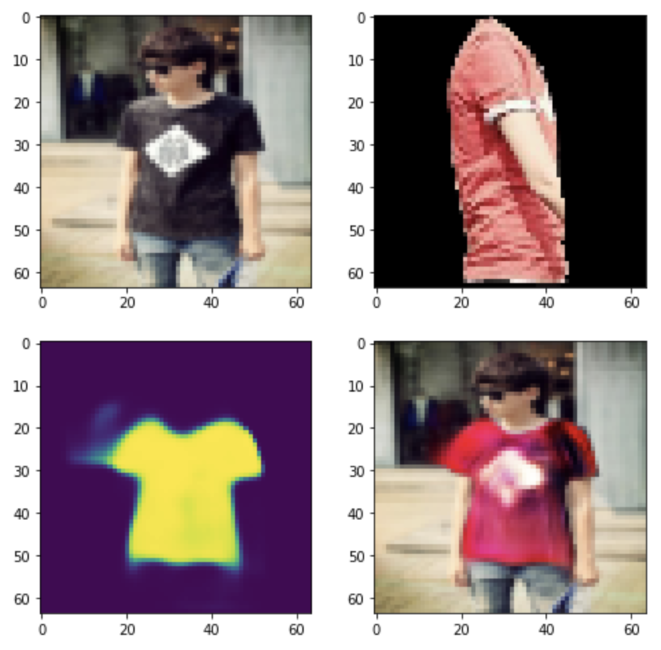
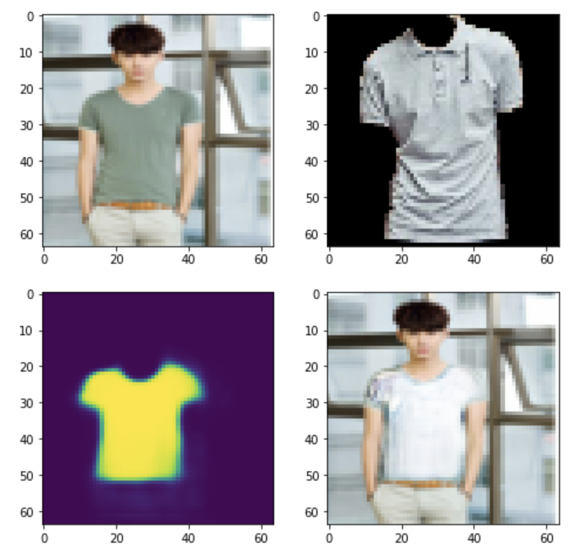
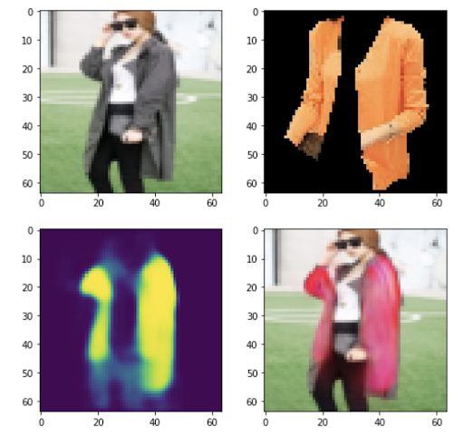

# Try-On-GAN

This project is done as a part of Deep Generative Models course in HSE (https://github.com/HSE-LAMBDA/DeepGenerativeModels).

It contains the attempt to generate a photo of a given person in a target clothing. 

Dataset: DeepFashion2 https://github.com/switchablenorms/DeepFashion2

## Some results:

